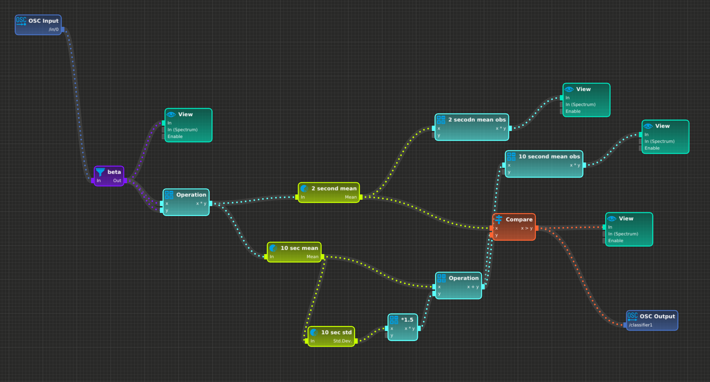

# brainhack22-eeg-vr-neurofeedback

## Results

### Neuromore pipeline

We used neuromore to visualize and process EEG data, using OSC for both the input
from the python EEG library and the output towards the VR pipeline.
Unfortunately right now neuromore [doesn't support saving files to
disk](https://github.com/neuromore/studio/issues/175), only to a personal user
cloud account. If this is fixed we'll upload the pipeline here.



# Initial README

## Unity

### Installation

Tried to run on Linux. Unity installs, but the ecosystem around Unity and Meta Quest seems very Windows-focused. Therefore focusing on Windows to avoid any unexpected issues.

1. Install UnityHub ([here](https://public-cdn.cloud.unity3d.com/hub/prod/UnityHubSetup.exe)).
2. Install the latest Unity editor (not LTS). Add-ons: VisualStudio, Android SDK (all), Windows SDK
3. [Configure Unity settings](https://developer.oculus.com/documentation/unity/unity-conf-settings/#build-settings)
3. Add any Meta quest integration packages (not yet sure if any are needed)


#### Work with Redis

Must use **Unity 2021.3.14f1**.

To be able to communicate with Redis from Unity check [this website](https://simulapps.com/access-redis-database-from-unity3d/).

## Redis

### Installation

Install Redis following [this instructions](https://redis.io/docs/getting-started/)

### Use

To start a redis server:
```bash
sudo service redis-server start
```

## Python

### Installation

#### Installing conda
If you don't have python, we recommand to install it using [conda](https://docs.conda.io/projects/conda/en/latest/). Conda is an open-source package management system and environment management system that runs on Windows, macOS, and Linux. Conda quickly installs, runs, and updates packages and their dependencies. Conda easily creates, saves, loads, and switches between environments on your local computer.

For a quick and light installation, We recommand to use [miniconda](https://docs.conda.io/en/latest/miniconda.html) a free minimal installer for conda.

Select the version corresponding to your operating system and download and install it.

#### Create a new environment

**[Windows user]**

Once completed, you should have access to a new shell named
`Anaconda Prompt` on your computer. Next instructions assume that your are using this shell.

**[MacOS/Linux user]**

Use your usual terminal (bash).


Launch your terminal and create a new python environment using the `conda create` command.

```console
conda create -n bh_eeg_vr python=3.9
```

Here we specify the name of the new environment `bh_eeg_vr` and the python version `3.9`.

Anaconda will ask you if you are sure you can to create this new environment

```console
Proceed ([y]/n)?
```
Press <kbd>y</kbd> (yes) then <kbd>Enter</kbd> to accept

#### Installing dependencies

Activate the new environment using:

```console
conda activate bh_eeg_vr
```
Notice that the current environment is displayed at the beginning of your shell:

```console
(bh_eeg_vr) C:\Users\user_name>
```

Install the required python packages:
 - `notebook` to use jupyter notebook interface:

    ```console
    pip install notebook
    ```

 - `mne` the main python EEG librairy.

    ```console
    pip install mne
    ```

 - `mne-qt-browser` a 2D backend for plotting MNE data.

    ```console
    pip install PyQt5 mne-qt-browser
    ```

- `pandas` library to work with dataframes

    ```console
    pip install pandas
    ```
- `redis` library to communicatr with redis databases:

    ```console
    pip install redis
    ```

### Use

Each time you want to use the environment, you need to activate it using:

```console
conda activate bh_eeg_vr
```

Then start the jupyter server:

```console
jupyter notebook
```

#### Redis 

Using Redis with Python:

```python
import redis
r = redis.Redis(host='localhost', port=6379, db=0)
r.set('foo', 'bar') # set key 'foo' to value 'bar
r.get('foo') # get value of key 'foo'
'bar'
```
